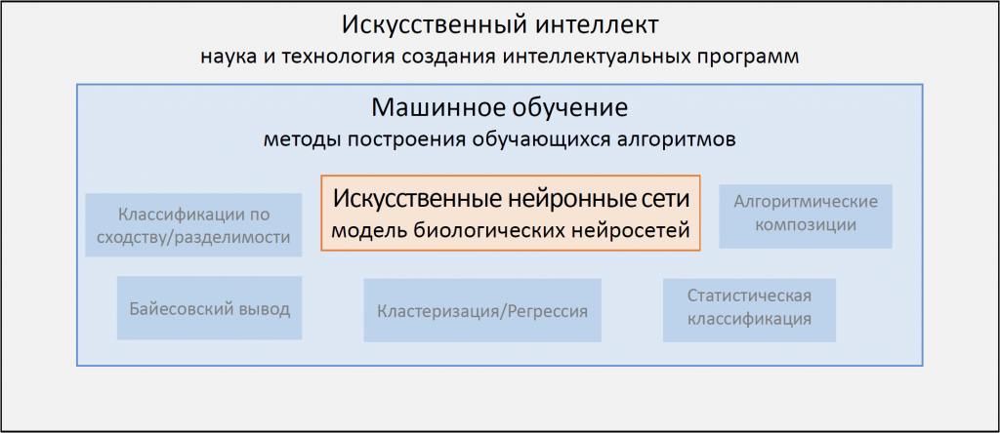

# Искусственный интеллект

## Термины

Искусственный интеллект (ИИ) (Artificial intelligence, AI):

1. наука о создании интеллектуальных (умных) машин (чаще всего — компьютерных программ).

2. свойство интеллектуальной системы выполнять творческие функции, которые считаются прерогативой человека.

Машинное обучение (Machine learning) — подраздел искусственного интеллекта, изучающий различные способы построения обучающихся алгоритмов.

Искусственные нейронные сети (ИНС) (Artificial neural networks, ANN) — упрощенные модели биологических нейронных сетей.

Искусственный нейрон
(Artificial neuron) — упрощенная модель биологического нейрона.

Искусственная нейронная сеть (ИНС) — совокупность взаимодействующих между собой искусственных нейронов

Синапс (Synapsis) — место стыка выхода одного нейрона и входа другого, в котором происходит усиление/ослабление сигнала.

## Основы

